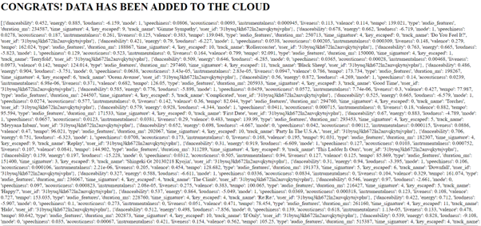
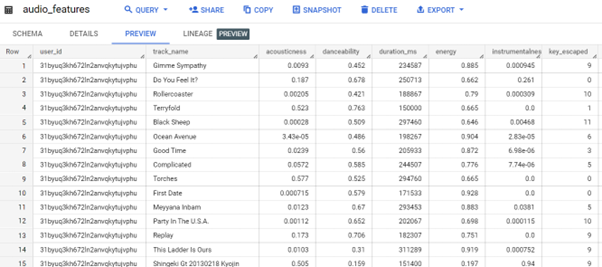
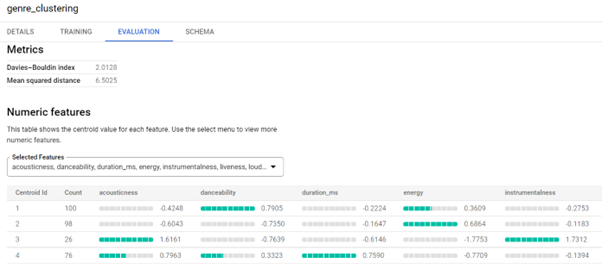

# Spotify Project 

## Description
This is an end to end Spotify genre detection system app that allows users to know what are the most popular genres currently being listened to. The Spotify API was used to authenticate users and stream audio features data of their top 300 songs - 50 top tracks and 250 playlist tracks. 

### First JSON dump of data in front-end
A simple template was made to display the tracks features data in json format. Backend used - Flask.

### Pushing the data to GCloud
The data was pushed to a Google Bigquery database in the instance of the project created by me, as shown below. This process was automated using the Bigquery API functions, in conjunction with Python.

### K-means clustering
On top of the existing data, cluster analysis was performed to determine what the cluster centroids were and what the current "genres" there are currently in the database. The metric used to determine the optimal number of clusters was the Davies-Bouldin index.

### Possible improvements
* Deploy the app in App-engine. I couldn't do this because my GCP free tier ran out. Of course, the more users that use the app, the more rich and diverse our dataset would become, giving more distinct and dense clusters.
* Create automated dashboards/better front-end visualizations and results.
* Use k-modes instead of k-means to determine clusters. In doing so, we can incorporate categorical attributes as well. This would involve writing the custom function in Tensorflow and importing the model to the Bigquery instance. Instead, I chose to go with the built in k-means model.
